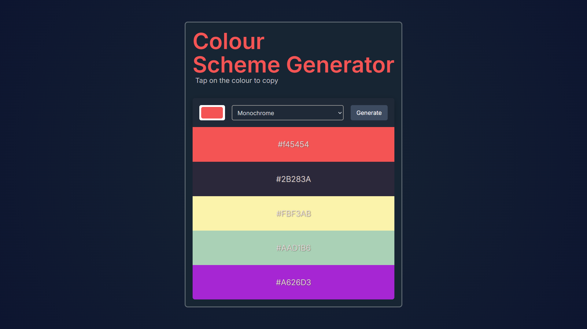
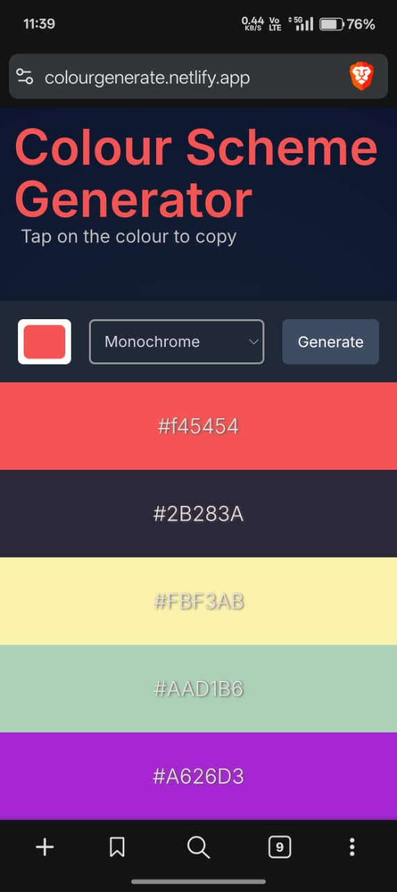

# 🎨 Color Scheme Generator

A modern, responsive Colour Scheme Generator that allows users to generate harmonious color palettes from a single base color. Built using vanilla HTML, CSS, and JavaScript, the app fetches real-time color schemes from The Color API and presents them in a clean, app-like UI.

Click on any color to instantly copy its HEX code.

[🔗 Live Demo](https://colourgenerate.netlify.app/)

---

## ✨ Features

- Generate **color palettes** from any base color.  
- Supports multiple **color schemes**:
  - Monochrome  
  - Monochrome-dark  
  - Monochrome-light  
  - Analogic  
  - Complement  
  - Analogic-complement  
  - Triad  
  - Quad  
- 📋 One-click copy to clipboard with visual feedback.
- Fully **responsive design** for mobile and desktop.  
- Subtle animations for a smooth, app-like feel.
- Default palette shown on initial load.  

---

## 🛠 How It Works

1. Select a base color using the **color picker**.  
2. Choose a **color scheme** from the dropdown menu.  
3. Click **"Get color scheme"** to fetch colors from [The Color API](https://www.thecolorapi.com/).  
4. The color palette is displayed in a grid. Click any color to copy its hex value.  

---
## 📂 Project Structure
colour-scheme-generator/
│
├── index.html   # Markup
├── index.css    # Styling & responsiveness
├── index.js     # App logic & API handling
└── README.md    # Documentation
---
## preview

---
## 💻 Technologies Used

- **HTML5** – Semantic structure  
- **CSS3** (Flexbox, Grid, animations, responsive design)  
- **JavaScript (ES6)** – DOM manipulation, API handling, event listeners 
- [The Color API](https://www.thecolorapi.com/) – Color scheme generation

---
## 📄 License

This project is open source and free to use.

--- 

## 🙌 Acknowledgement
Built as a frontend practice project focusing on UI polish, API usage, and user experience.

Happy Coding!

